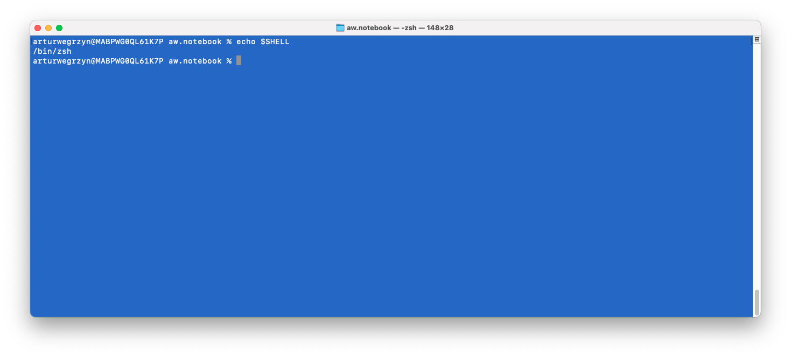
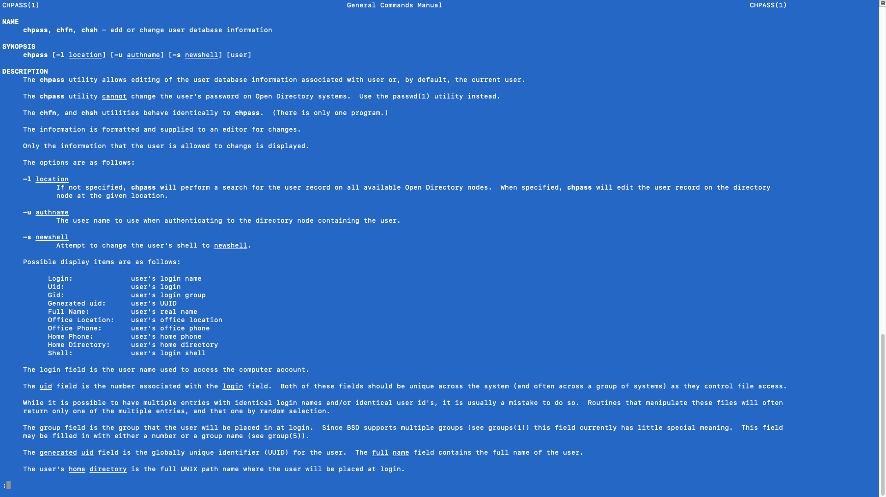

# How to change terminal's default shell under MacOS?

### 1. Check the shell that you are using
To check the active shell, open the terminal and run:

```
echo $SHELL
```

to access the value of the environment variable SHELL. In most cases it will be either 'zrc' or ''. Cf. the screenshot below:




### 2. Change to the shell of your joice

Suppose that your active shell is zsh (i.e. [Z shell](https://www.zsh.org/)) and that you want 
to switch it to bash shell.

The command you need is  ```chsh -s /bin/bash``` - provided that the path you your bash is indeed ```/bin/bash```, which it most likely is (you can determine the path to your bash by running ``` which bash ``` command in the terminal).

After you execute the ```chsh -s /bin/bash``` you will be asked for your password. After you type it, you need to restart your terminal for the change of shell to take effect. 

### 3. Explanatory remarks
The reson why ```chsh -s /bin/bash``` works is given on the man page - just run ```man chsh``` in the terminal - the output of the command is given in the screenshot below - cf. the ```-s``` section:


