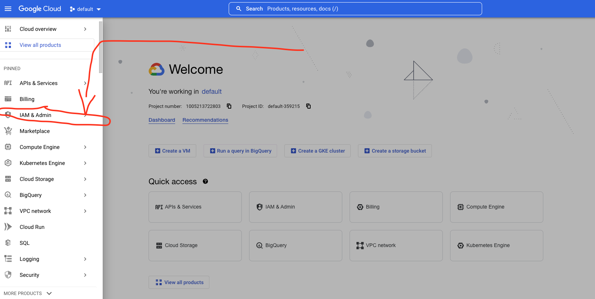
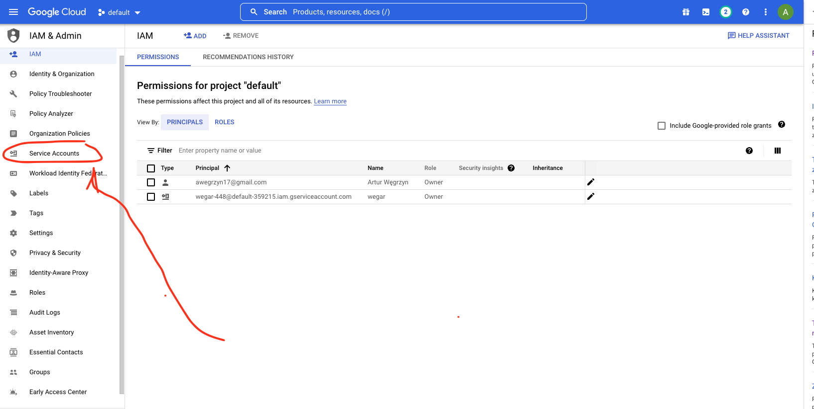

## How to view service accounts at Google Cloud?

First, go to the GC Console at cloud.google.com.

Then, go to the navigation menu via the button in the left-top corner.

Then, go to "IAM & Admin" as per screenshot below:

In the IAM panel that opens pick "Service Accounts" on the ribbon on the left hand side as per screenshot below:

