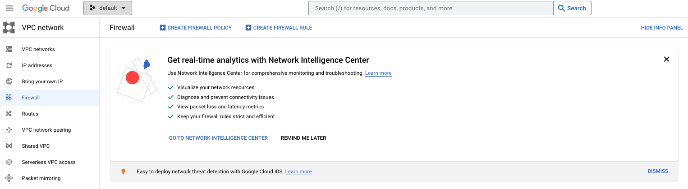
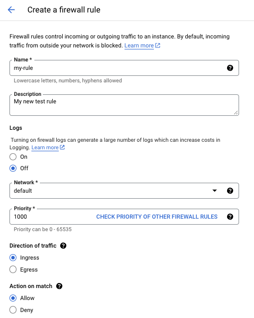
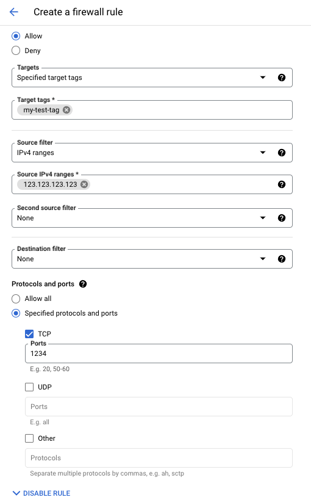
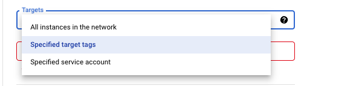
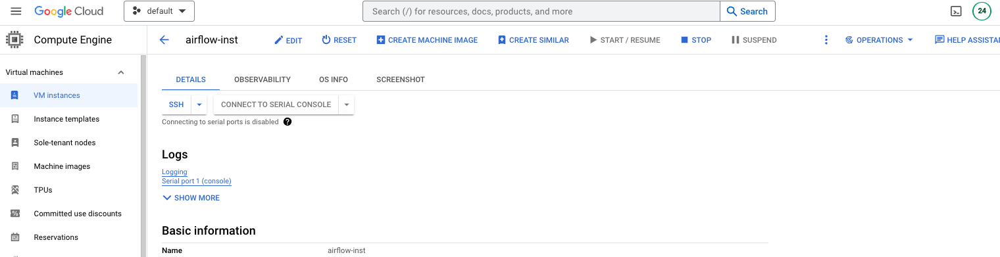
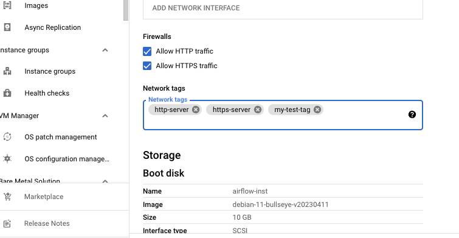

## Networking Topics: General and Google Cloud Platform-related


### 1. Check WiFi Router IP on macOS

#### 1.1. macOS
Run:

```
netstat -nr|grep default
```
#### 1.2. Ubuntu

Run:

```
ip route
```


### 2. Check My *External* IP on macOS

#### 2.1. macOS
Run:

```
curl ipecho.net/plain ; echo
```

#### 2.2. Ubuntu

Run: 

```
curl https://ipinfo.io/ip
```


### 3. Create Firewall Rule on GCP and Apply it to a VM (Compute Engine Instance)

#### 3.1. Create Firewall Rule

In order to create firewall rule, go to `VPC network` and then pick `Firewall` on the ribbon on the LHS.

You should see this:



To add a new rule click on `Create firewall rule` button on the ribbon on top. In this example I am going to create a simple rule that is going to limit the access based on IP.

Example of definition of such a rule is provided on the two screenshots below.

First screenshot - nothing particularly important here: 


 
Second screenshot - defining rule parameters. I am creating a rule that allows the access based on the external IPv4 of the client (in the presented case only the client with external IP address `123.123.123.123` is allowed to connect and only on the port `1234`):

*Key point*: make sure that you are providing external IP and not local IP here while defining the rule! Extraction of external IP is described above.

 

Crucially, please note that a tag *my-test-tag* has been defined for this rule.

Aside from the changes shown at screenshots, all the other parameters are held at default values.

Save the rule. It should show up in the list on panel of firewall rules.

#### 3.2. Apply Firewall Rule to Compute Engine Instance

The following options of applying an existing firewall rule are available:



I am only going to consider `Specified target tags` option as the other two are self-explanatory.

Suppose that you have an instance that you want to apply the rule to.

Furthermore, recall that the rule we want to apply has a tag *my-test-tag* assigned to it.

In order to apply this rule to a VM, go the Compute Engine panel in the Console and click on the VM that you want to apply the firewall rule to and pick `Edit` at the ribbon on top - cf. the screenshot below:




After you enter edit mode of the VM, add the tag of your firewall - *my-test-tag* in our case - in the section `Network tags`:



NOTE: you most likely also want to tick the `http` and `https` checkboxes to allow the firewall traffic!
