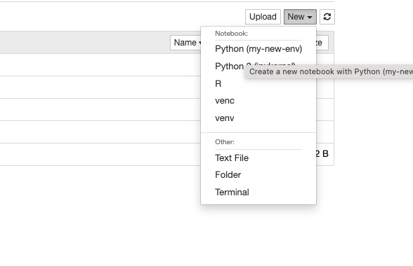

# Setting up jupyter workspace under MacOS (in PyCharm)

Open your project in PyCharm.

Go to the terminal (Ctrl+T).

Create and activate virtual environment using the following terminal commands:

```
virtualenv venv
source venv/bin/activate
```

Install the packages that you need with pip inside the `venv`

In order to be able to use the jupyter notebook install the python package `jupyter` and `ipykernel`:

```
pip install jupyter
pip install ipykernel
```

Then, run the following commands - cf. [the source](https://ipython.readthedocs.io/en/latest/install/kernel_install.html#kernels-for-python-2-and-3):

``` 
python -m ipykernel install --user --name my-new-env --display-name "Python (my-new-env)"
```



